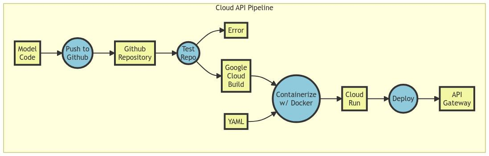

# Google Cloud API Endpoint Demo

## Goal
This repository is designed to serve as a demo for a re-designed workflow to share data using Google Cloud Endpoints.
This README file will be a tutorial for the repo, giving an overview of the files utilized in the Google Cloud Process.

## Tutorial Outline
- Data Flow Diagram
- Pre-Tutorial
- Required Files
- Cloud Set Up
- Programming for Endpoints
- Creating Tests
- Docker
- YAML
- Current Status

## Data Flow


## Required Files
Here are the files that are needed in order to successfully work through this data pipeline.

### app.py
* A Python application that provides a service
* Needs to have a web socket open with port 8080

### requirements.txt
* List of all required python packages and versions for app.py

### dockerfile
* Defines how to build docker container
* Builds container for app.py
* Installs required packages in requirements.txt

### cloudbuild.yaml
* Defines how to pull files, call docker building, and deploy into google cloud run

## Pre-Tutorial
I followed this youtube tutorial to create the initial implementation of this application. Credits here:

https://www.youtube.com/watch?v=0mfng-vih_I

# Part 1: Cloud Set Up
There are a number of steps to initally set up the Google Cloud Instance. We will assume this project will be started with a fresh Google Cloud Instance and empty Github Repo. Part 1 gives an overview, and Part 2 will go into more detail of their importance.

### Download docker locally for testing
   * Optional but recommended

### Application
   * Have an application created in Python or any other type of web interface.
   * This demo has *app.py* which is a Python application buit utilizing Flask as a web gateway.
   * Have port 8080 open for interaction.

### Requirements.txt
   * Add any Python packages that are necessary.

### Dockerfile
   * Create a dockerfile that will create a deplloyable docker container of the above application.
   * Open this on port 80 for web interface.

### Test docker container locally (optional)
   * Test if docker builds locally using a terminal.
   * ```docker build -t clouddemoname .```
   * ```docker run -name clouddemoname -p 5001:8080 -d clouddemoname```
   * Go to ```localhost:5001``` and see if demo works properly

### Cloud Build YAML
   * Create a YAML file that will test, build, push, and deploy code.
   * The current demo has 3 steps. Testing to be implemented soon.
   * More details on YAML files in section below.

### Github setup
   * Create a new GitHub Repo.
   * Upload and create an initial push.

### Cloud Console
   * Enable google cloud run API service
   * Enable google build API service
   * Enable Identity and Access Management (IAM) API

### Cloud Run Service
This is a long section, refrence linked video if necessary.
   * Find cloud run tab (left menu)
   * Create service
   * Continuously deploy from source repository
   * Set up with Cloud Build
   * Link GitHub, select repo
   * Build configuration
     * Build type /dockerfile
   * Configure other settings as needed, this demo leaves them default.
   * Create.

### Edit Continuous Deployment
   * Give a name ```RTGS-CloudAPI-Demo```
   * Scroll down and change 'Location'
     * Repository (*cloudbuild.yaml* is with our github repo)
   * Edit Substitution variables
     * Add ```_GCR_HOSTNAME``` and set the value to ```us.gcr.io```
     * Add ```_PROJECT_ID``` and set the value to the project ID given in the cloud console dashboard

#### The intitail setup is complete!

# Part 2: Further File Details

## Programming for Endpoints
Our typical research workflows focus on getting single results and moving on. This will not work in this case. We need to create user-focused methodology. Data endpoints are the way to do this!

In Python, Flask is an easy and powerful web interface toolkit. Other applications can be made for the Google Cloud Service, but this demo uses *app.py* as the primary application. *app.py* has a simple web interface built on flask. It takes user input of a date, and returns values created in a dataframe of given data on the 2022 Becker UMN farms.

You can create almost any application, though there are a couple **required features** that allow cloud to communicate with the program:
* Web service
* Host 0.0.0.0
* Port 8080 is OPEN
* Note the application name (for Docker later)
* Note what packages/imports are necessary (for Docker later)

## Creating Tests
Testing is incredibly important for any workflow. Given we are working on public-facing code, it is important to have a robust testing scheme. *todo*

## Docker
Docker is a way to make our code easily run anywhere with little worry of environment errors. It containerizes the code so that it will run the same every time and on every compatible machine.

For this setup, we have two **required files** to get docker working:
* dockerfile
* requirements.txt

### Dockerfile
This file creates the docker container for our applicaiton. This file is called during the YAML files (next section). For this demo, it creates a Python environment within the container and then runs *app.py* whenver the Docker container is launched.

**Required features:**
* Port 80 is OPEN (web interface)
* Run the application when container is launched

### requirements.txt
For the Python implementaion, *requirements.txt* is called inside the dockerfile to install any necessary packages for our applicaiton to run. All that is in the file is a list of Python packages with version numbers.

### Testing Docker
We can test if the dockerfile works properly locally by running the following commands (assuming we have docker installed on local machine):
   * ```docker build -t clouddemoname .```
   * ```docker run -name clouddemoname -p 5001:8080 -d clouddemoname```
   * Go to ```localhost:5001``` and see if it works properly

## YAML
YAML files are a way to execute terminal commands easily. They consist of 'steps' which are different sections of commands. This demo has 3 steps:
* Call Google Cloud Build to build the docker container
* Push the docker container from cloud build to google cloud run
* Deploy the docker container on google cloud run

The *$_variables* are autofilled credentials that were defined in the initial cloud setup. The *cloudbuild.yaml* file in this demo is the first thing called when there is a push to the GitHub repo.

Additionally, code testing could be added to the YAML file by defining a cloud program that tests the code to be run whenever there is a push.


# Part 3: Current Status
The project has a very simple working demo at this link:

*Link removed because it costs me money on google cloud*

## Future Steps
* Create testing / QAQC features
  * Compare GitHub vs Google Cloud for testing Code
* Link Google Cloud API to allow API connection to our web service
* Create more advanced demos than a simple webpage